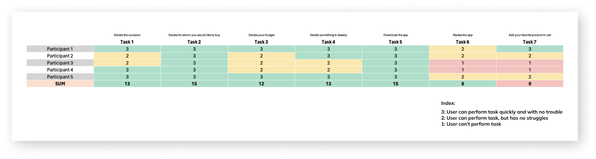
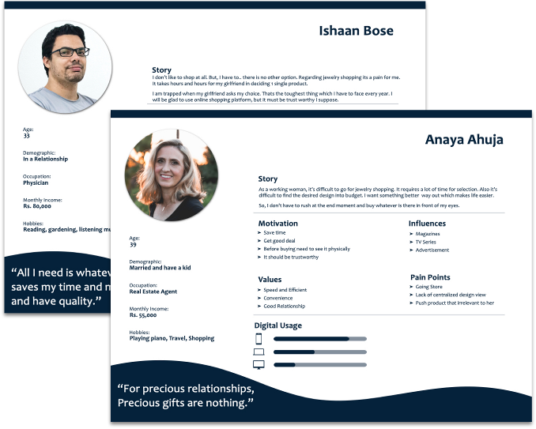
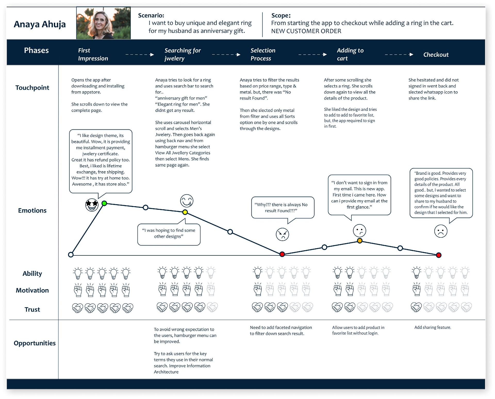
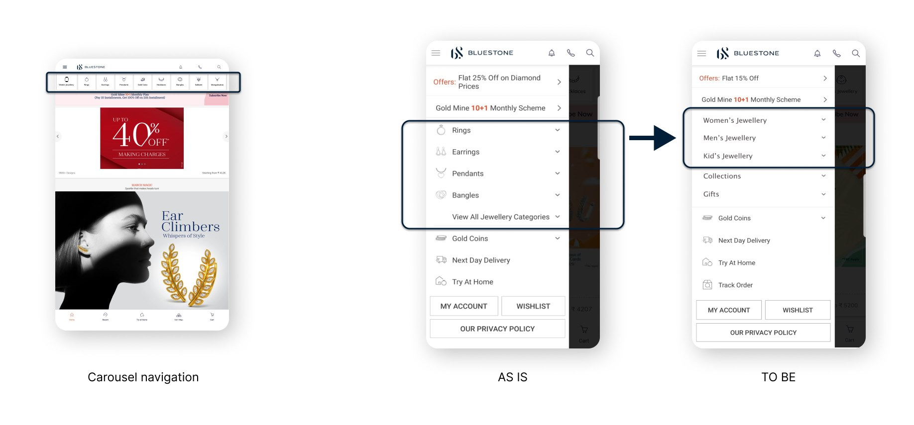
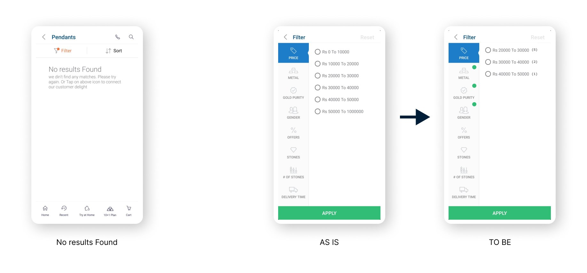
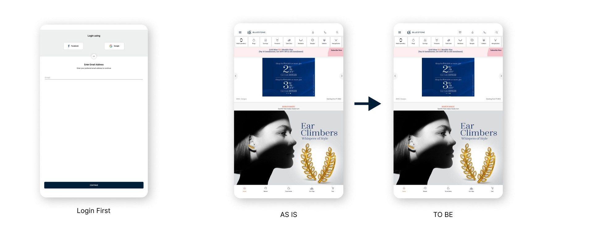
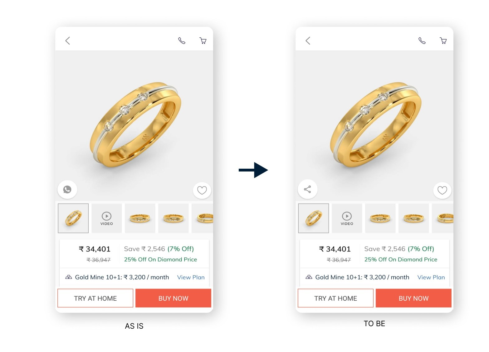

<!-- # BlueStone -->

<!-- {: width="720" } -->

## Overview

**Bluestone case study**

**Tool:** Sketch

**Method:** Usability testing

**Background:**
 The mission of Bluestone is to provide 100% certified jewelry, they aim at revolutionizing the fine jewelry and lifestyle segments in India with a firm focus on craftsmanship, quality and customer experience. 

**Goal:**

To identify problems faced by the users in their journey for the mobile app.

**Process:**
Learn.Build.Measure

## Industry Benchmarking

To better understand the market Bluestone is in, and its competitors I first conducted an industry benchmark on features, design styles and channels.

Looking at the immediate competitors in this market space as well as smaller players gave an idea about what is available to the consumer today, and how things can be done better.

## Usability Testing

The target user base comprised of new users who are either busy or would not spend much time on selecting gifts, along with users who have never used the mobile app before. I embarked on a journey to understand how they would go about with the new app and how their user journey would be.

Recruited participants: 5

Scenario: An occasion is approaching of your loved one, you want to buy something precious. As your time and budget what would be the first thing comes in your mind that you would like to buy and what will be the budget. Will the given app fulfill your requirement?

Task:

1. Decide the occasion.
2. Decide for whom you would like to buy.
3. Decide what will be your budget.
4. What would you like to buy specific to jewelry
5. Go to app/play store to download the app.
6. Review the app in general.
7. Now, what have you decided, try searching it and add it to cart. Also, feel free to explore the application functionality.

#### Usability test result:

<!-- [{: width="720" }](Images/BS_Usability_Testing.png "Usability Testing") -->

The test results highlights the problems faced by users during the activity steps. Below with the help of personas and user journey map I have highlighted and summarized the design solutions which require small tweaks. As small changes can be done much faster and in a cost effective manner, it helps in reusing the same existing designs and avoid complexities.

We all already know that overhaul redesigns of systems often tend to annoy the user more since they need to rediscover the app.

#### Persona

Based on the users interaction and activity data, I created 2 personas that represented the recruited participants to have the consolidated data at my disposal.

<!-- [{: width="720" }](Images/BS_Persona.png "Persona") -->

#### User Journey Map: 

I asked each participants to think out loud during testing to understand their actions and reactions with their words and perceptions on each occasion. I leveraged this to map the user journey and find the solution to their pain-points and blockers.

<!-- [{: width="720" }](Images/BS_User_Journey_Map.png) -->

## Design Recommendations 

#### I have summarized below my findings with detailed graphical depiction.

**1. Searching for jewelry:** On landing page, the carousel navigation already exists which is the most used categories for navigation by existing users. But by observing the user behavior it was clear that having a broad category division such as Women's Jewelry, Men's Jewelry, Kid's Jewelry in the menu list would better help the users to get to the products they actually were trying to find faster, and also giving the business more opportunity to interact with the users in the limited time they spend on the app. The faster the navigation journey for the user becomes, the more time the user spends on browsing the products leading to more higher sales opportunities for the business. Below I showcase the current and suggested approaches.

<!-- [{: width="720" }](Images/BS_Searching_Jewel.jpeg "Searching") -->

**2. Selection Process:** Adding faceted search navigation to filter down search results, instead of displaying "No results Found" would be better approach. During my tests users usually gave up looking for the item if the search displayed the "No result Found" message. This guides the users to discover the content easily with the help of counter and would able to solve the blocker for this issue.

**Example:** If the approach displays Facets suggesting the user different price ranges which might be close to their budget it could also result in a up-selling opportunity for the business and not discourage the users that the item they are searching for is unavailable. The item is present on a different budget range which could be close to the user budget range. This aspect of the application is designed to replicate the user experience what the user will perceive when shopping in a store where the agent will also showcase different options from other price ranges to make a higher sale.

<!-- [{: width="720" }](Images/BS_Selection_Process.jpeg "Selection Process") -->

**3. Adding to cart:** At the phase of adding a product in to cart, some participants loved more than 1 product which they wanted to add them in their favorite list or bookmark them where they met with login screen. This made many of the users uncomfortable since they were using the app for the first time and did not want to share the email or any details before deciding on the purchases. Additionally, the comments were about why do I need to create an account or login just to bookmark a product. The behavior also made the users hesitant to proceed further.

Providing an access to the app without login increases user engagement and they get to see the real value offering a much smoother experience. Many business are unsuccessful to turn in new users mostly because of this restriction where privacy concerned users or users who just do not want their mailboxes spammed for offers opt out of apps. Below shows an alternative for the use-case to have the feature right on the Home Screen for having the easy access on marking the product for their favorites. Once a user is willing to make the purchase the account creation screen could follow on that user flow.

<!-- [{: width="720" }](Images/BS_Add_To_Cart.jpeg "Add to cart") -->

**4. Checkout phase:** Before checkout one user wanted to confirm her partner's choice and view on the product she selected. But due to the lack of sharing feature on the application it was impossible to do so, and eventually she did not complete the checkout. With the rise of social media and sharing this is a very required feature for any shopping application. My recommendation is to add a sharing feature to resolve this request as shown below.

<!-- [{: width="720" }](Images/BS_Check_Out.jpeg "Checkout") -->

## Wrapping Up

Usability test has provided a good insights on how users think and behave with a product. How their journey could be more comfortable and feel more natural to achieve the goal.

From the perspective of the business these changes could improve user engagement and increase the possibility of enhancing sales.

My work on this project shows that it's not necessary to do major overhaul to the product, design and technical changes on aspects which could be targeted and fixed. It is certainly a win for both the business and the consumer if the right journey is incorporated into the application leading to long term success and improved user experience.