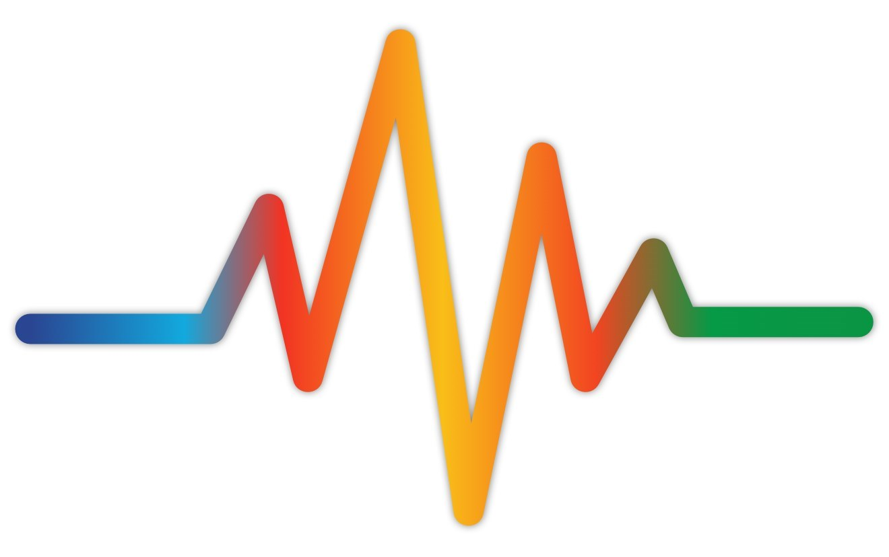
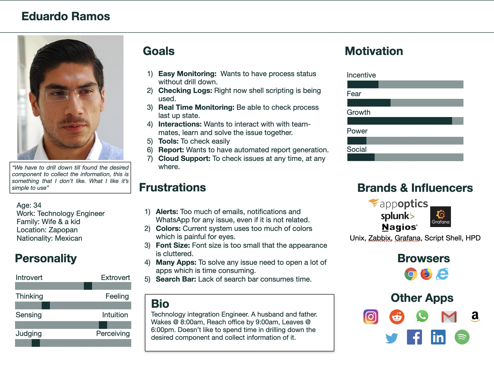
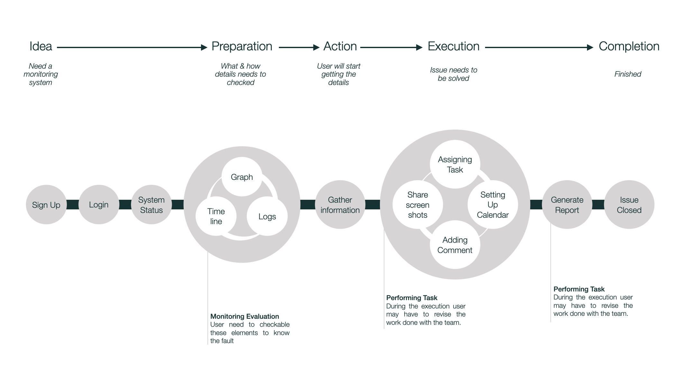
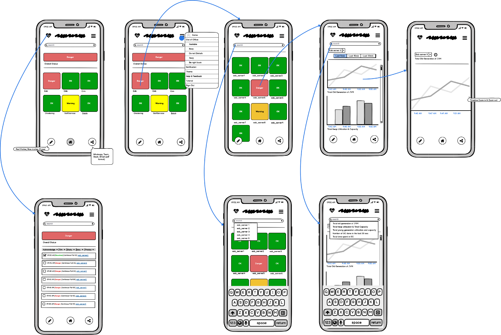
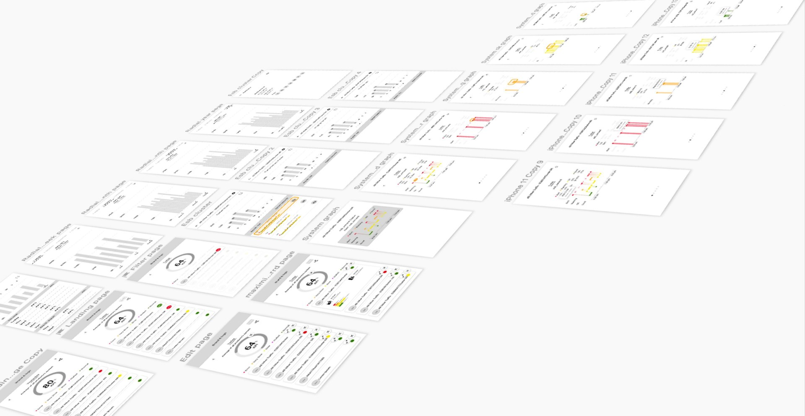
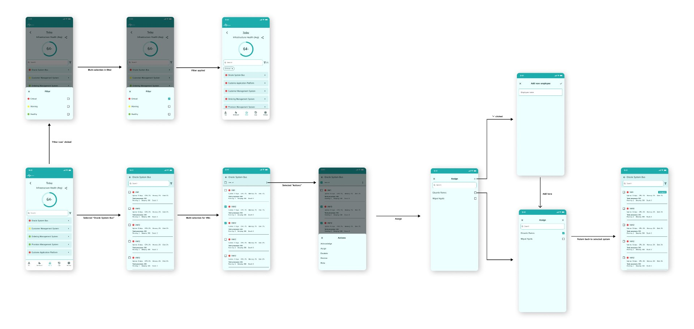

<!--  -->

## Project: Monitoring System

## Overview

**Role: UX Designer**

**Tools: Balsamiq, Sketch and Sketch Mirror**

## Project Background:

Monitoring System is unified real time system monitoring app. This name was generic
as per the requirement. This app is built to provide a handy solution for monitoring
specific servers for a fixed user base. The app enables the users to monitor and view
the system health status, and in case of failure act instantly avoiding any possible
monetary loss caused due to a outage in production system.

**PS:** The system for which this is implemented is a monolith system.

## The Problem:

Non-technical teams don't understand where the problem is in the current system, so
they required an easy view of the infrastructure monitoring which is more
comprehensive to understand and navigate.

## Goal:

Create a unified real time KPI & system monitoring app. Identifying what information
users want to see that help them to quickly identify and detect the problem at early
stage.

## Process:

Design Thinking

# Research

## Survey:

A mix of qualitative(80%) and quantitative(20%) survey method was used for research
and collect data from a predefined group of respondents to gain information and
insights.

**Competitive analysis:**

I studied a few monitoring apps design across different industries to understand,
identify patterns, and catalog they are offering to users. Some of the solutions reviewed
were from Zabbix, AppDynamics, Splunk, Nagios etc.

- Real time graph displayed
- Ability to notify/alert users when there is a problem
- Most of the applications have additional features which is not required as part of the scope.
- Paid Apps go above budget.

## Persona:

Based on the user survey conducted and the research done I created persona to
represent the user type in order to understand the user needs, experiences, behavior
and goals.

[{: width="720" }](Images/MS_Persona.jpeg "Monitoring System Persona")

## Task Model

I created **Task Model** to capture the understanding of the user's
decision making processes explained in the image below.

[{: width="720" }](Images/MS_Task_Model.jpeg "Task Model")

# Feedback and Design iterations

## Round 1 with low-fidelity wireframe

I created a quick key wireframes of main functionality using
Balsamiq to get into the users reaction of the design pattern
and find if it is suitable for them or required more changes. Flow
diagram below.

[{: width="720" }](Images/MS_Balsamiq_Wireframe.png "low-fidelity wireframe")

**Feedback**

- Alert overview on the screen was helpful.
- Overall, information was confusing.
- Too many clicks to know or get to the problem.
- Repetitive navigation and Call To Action were not helping.
- Too many colorful elements.
- Jargon's are mixed.

**Pivoting**

Once I identified user's needs, I revisited my previous work and
created new mocks using Sketch tool. I introduced new
elements, gave more focus to graphs, in order to help visualize
some important information. Clicks were introduced as part of
interaction.

## Round 2 with mid fidelity wireframe to explore interface

Again I conducted usability test, but, this time I used Sketch
Mirror to test the prototype. Validating Ideas, and testing if it
has improved the comprehension and user emotions around the
monitoring.

[{: width="720" }](Images/MS_Mid_Fidelity.jpeg "mid-fidelity")

Feedback

- Better understanding of visualizing system.
- Some modification needed in the information architecture.
- Graph style needed to be changed.

## The final round

I incorporated all the feedbacks and improvements requested
by the stakeholders and the 3rd version was appreciated and
approved. Below are some of the interactions that carry out
through home page.

The navigation chart / path below shows how the user will
interact with the application to reach the desired state or action
within a short period of time. Thus avoiding the use of bulky and
overused features of competing applications.

[{: width="720" }](Images/MS_Final_Round.jpeg "Final Delivery")

## My thoughts on this today

With the volatility of the industry and more and more solutions
moving to the cloud systems there is still absence of adaptive
monitoring solutions. Solutions which can be customized on
business level. The generic solutions provided by many
companies end up with many functionalities.

The need for in-house tools in monitoring infrastructure and
applications is not new. It will still be present in the industry.
There are advantages and cost benefits of choosing such
solutions for enterprises depending on their specific use cases.

There is still a lot to take away from this project, and the
solution still applies with just the keywords and terms being
changed. The beauty of my designed solution is that its based
on user requirements and is oriented towards increasing the
productivity and response time of the teams, making it stand
the test of time itself.